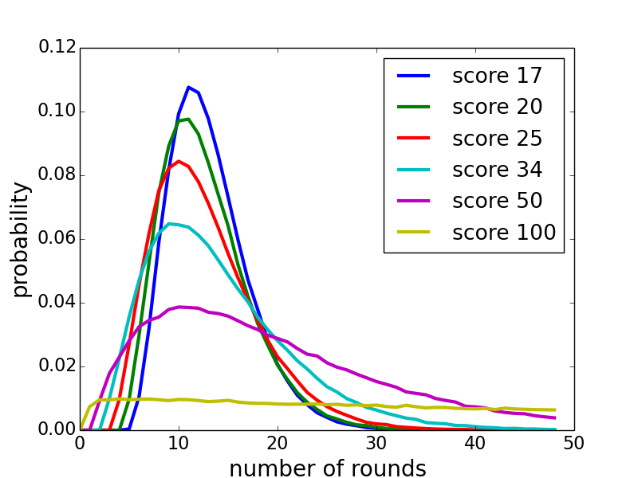

# dice-game-100
Simulating and evaluating different strategies in a dice game where a player should reach 100 points first.

Rules:
 * A player can throw the die until they 1) choose to stop, or 2) get a one.
 * If the player stops before throwing a one, the accumulated points are stored.
 * If the player throws a one, the points of that round are lost.

